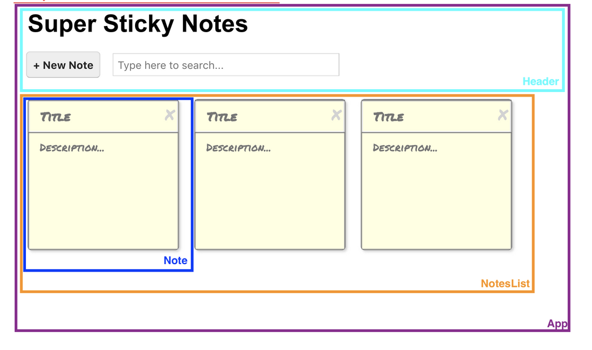

# React Notes

<a href="https://tecnate.dev" target="_blank" rel="author">Tecnate</a> | Last Updated: 2024.04.05

## Table Of Contents

-   [React Notes](#react-notes)
    -   [Table Of Contents](#table-of-contents)
    -   [About This Document](#about-this-document)
    -   [Quick Concepts](#quick-concepts)
        -   [1. Components](#1-components)
        -   [2. ReactDOM](#2-reactdom)
        -   [3. Class vs Functional Components](#3-class-vs-functional-components)
        -   [4. JSX - extended JavaScript](#4-jsx---extended-javascript)
        -   [5. State](#5-state)
        -   [6. Event Handling](#6-event-handling)
        -   [7. Asynch setState](#7-asynch-setstate)
        -   [8. Props](#8-props)
        -   [9. Refs](#9-refs)
        -   [Controlled Components](#controlled-components)
    -   [Installing React](#installing-react)
        -   [Option A: Installing React Automatically](#option-a-installing-react-automatically)
            -   [The Create React App Toolchain](#the-create-react-app-toolchain)
            -   [Important Files \& Directories](#important-files--directories)
        -   [Option B: Installing React Manually](#option-b-installing-react-manually)
            -   [1. Understand The JavaScript Ecosystem](#1-understand-the-javascript-ecosystem)
            -   [2. Install Prerequisites](#2-install-prerequisites)
            -   [3. Initialize Package Manager (NPM)](#3-initialize-package-manager-npm)
            -   [4. Install React Packages](#4-install-react-packages)
                -   [Install React Dependencies](#install-react-dependencies)
                -   [Install Dev Dependencies](#install-dev-dependencies)
            -   [5. Add Files To Your Project](#5-add-files-to-your-project)
            -   [6. Update Your Scripts](#6-update-your-scripts)
            -   [7. Execute Your Scripts](#7-execute-your-scripts)
        -   [Option C: Cloning Existing React Projects](#option-c-cloning-existing-react-projects)
            -   [Cloning From GitHub](#cloning-from-github)
    -   [Uninstalling React](#uninstalling-react)
    -   [UI Layout](#ui-layout)
        -   [Installing React Grid (Optional)](#installing-react-grid-optional)
    -   [Naming React Components](#naming-react-components)
    -   [Organizing Your Project](#organizing-your-project)
    -   [Lifecycle Methods](#lifecycle-methods)
    -   [Components \& Props](#components--props)
        -   [Presentational \& Container Components](#presentational--container-components)
            -   [Defining Presentational Components](#defining-presentational-components)
    -   [Starting A Greenfield Project](#starting-a-greenfield-project)
        -   [I. Dividing The UI Into Components](#i-dividing-the-ui-into-components)
        -   [II. Coding A Static UI](#ii-coding-a-static-ui)
        -   [III. Organizing Data Flow](#iii-organizing-data-flow)
        -   [IV. Adding Interactivity](#iv-adding-interactivity)
    -   [React Hooks](#react-hooks)
        -   [useState vs useEffect](#usestate-vs-useeffect)
            -   [useEffect()](#useeffect)

## About This Document

This document is a brain dump for things that I've picked up about the React library. Use at your own risk!

<br>

## Quick Concepts

React is a JavaScript library used to build user interfaces by implementing modular code that can be reused throughout your application.

Here are the fundamental concepts you'll need to build/maintain React apps:

### 1. Components

### 2. ReactDOM

### 3. Class vs Functional Components

    - ❌ Don't use class components (deprecated).
    - ✅ Use functional components.
        - State management is decoupled with function components (cleaner setup/inheritance).
        - Libraries use hooks; classes won't be compatible.

### 4. JSX - extended JavaScript

Text, numbers, arrays render as text.

```jsx
<p>[123] vs {[456]}</p>
// [123] vs 456
```

Objects return an error if rendered.

```jsx
<p>{{ name: "Clark" }}</p>
// Error
```

Booleans don't render.

```jsx
<p>{true === true}</p>
// (renders nothing)
```

Variable render their values.

```jsx
const name = "Clark";
<p>{name}</p>; // Clark.
```

> Syntax Note: `{}` vs `{ {} }`: The outer pair of `{}` indicates a JSX expression, while an inner pair `{ {} }` contains an object within the expression.

### 5. State

### 6. Event Handling

### 7. Asynch setState

### 8. Props

-   **props**: properties passed down from Parent Component to Child Components.

### 9. Refs

### Controlled Components

Inputs in React forms. Here is a basic example of a controlled input for a form which has `search` and `setSearch` being passed to the Component as props.

```jsx
<form
    className="searchForm"
    onSubmit={(e) => e.preventDefault()}
>
    <label htmlFor="search">Search Posts</label>
    <input
        id="search"
        type="text"
        placeholder="Search Posts"
        value={search}
        onChange={(e) => setSearch(e.target.value)}
    />
</form>
```

<br>

## Installing React

### Option A: Installing React Automatically

Use the **Create React App** toolchain to spin up a React application quickly using Node.js, npm, and npx.

1. Install Node, npm, and npx if you haven't already.
    - Check Node installation: `node -v`
    - Check npm installation: `npm -v`
    - Check npx installation: `npx -v`
2. In your terminal, navigate to the directory where you want to create your project root.
3. Run the Create React App, replacing "project-name" with your own project: `npx create-react-app project-name`.
4. Your project can now be viewed in your browser:
    1. `cd project-name`
    2. `npm run start`
5. For simple projects, you can delete the following:
    1. **src/App.test.js**
    2. **src/reportWebVitals.js**
    3. Open **src/index.js** and delete:
        - `import reportWebVitals from './reportWebVitals';`
        - `reportWebVitals();`.
    4. **src/setupTests.js**
    5. **src/logo.svg**
        - Delete any any logo code in **App.js**

#### The Create React App Toolchain

-   **toolchain**: a group of tools and libraries that work together.
    -   The Create React App toolchain includes Babel and Webpack.
-   **Node.js (Node)**: an open-source, multi-platform runtime environment that runs on a server. Allows you to use JavaScript outside of the browser environment.
-   **npm (Node Package Manager)**: a collection of open-source packages and package manager.
-   **npx**: an npm package runner that allows you to execute packages without installation.

#### Important Files & Directories

-   **package.json**: Contains the metadata about the project, a list of dependencies, and scripts you can run using the npm command.
-   **package-lock.json**: An automatically generated file by React that shouldn’t be touched.
    -   This file records the specific version of dependencies to ensure all devs are working with the same packages.
-   **node_modules**: An automatically created directory that should never be placed under version control.

### Option B: Installing React Manually

#### 1. Understand The JavaScript Ecosystem

React requires several things to work properly. Here are the JavaScript tasks that need to be addressed with their respective tools:

1. Managing packages - npm
    - **package**: a directory with at least one file called "package.json" that contains metadata about said package.
2. Using a module system - ES6
    - **module**: JavaScript code that can be imported/exported for use elsewhere.
3. Preprocessing JavaScript - Babel
    - **Babel**: a preprocessor that compiles ES6, applied using Webpack.
4. Bundling everything into a single file for the browser - Webpack
    - **Webpack**: a module bundler that ultimately injects a single new file as HTML to be read by the browser.
    - **Bundling**: using the top of the code hierarchy (index.js), specifying the preprocessor (Babel), then producing a single file with the final code (Webpack) for the browser to read.

#### 2. Install Prerequisites

1. [Node.js](https://nodejs.org/en/)
2. [VSCode](https://code.visualstudio.com/) or other text editor.

#### 3. Initialize Package Manager (NPM)

In your terminal, create the root directory for your project **before** initializing NPM.

```bash
# Make your project's root directory
mkdir path/to/directory/myProject

# Navigate into your project root
cd path/to/directory/myProject

# Initialize Node Package Manager
npm init

# You should see a prompt for with the name of your project.
# Hit 'Enter/Return' for all prompts.

# "Is this ok?"
yes
```

#### 4. Install React Packages

There are two types of packages you need to install:

> -   **dependencies**: packages imported by our application.
> -   **devDependencies** packages required for development and testing.

##### Install React Dependencies

```bash
# Install React
npm install --save react

# Install React-DOM
npm install --save react-dom
```

##### Install Dev Dependencies

```bash
# Install Babel & Webpack
npm install --save-dev @babel/core @babel/preset-env @babel/preset-react babel-loader webpack webpack-cli webpack-dev-server html-webpack-plugin

# Install URL Loader & File Loader
# For image rendering on a local server
npm install --save-dev url-loader file-loader

# Install CSS/Style Loader
npm install --save-dev style-loader css-loader

```

#### 5. Add Files To Your Project

Add the following templates into the root of your project:

1. [index.html](root-file-templates/index.html)
2. [index.js](root-file-templates/index.js)
3. [webpack.config.js](root-file-templates/webpack.config.js)
    1. Double check that the `template` and `entry` filepaths to your root **index.html** and **index.js** are correct!
    2. If your images aren't loading, you may need to add/remove file-loader rules from the configuration file. See [file-loader documentation](https://www.npmjs.com/package/file-loader) for examples.

#### 6. Update Your Scripts

Open your **package.json** file and update your scripts like so:

```json
"scripts": {
        "start": "webpack-dev-server --mode development --open --hot"
        },
```

This will enable you to execute the webpack-dev-server and allow for live reloading of changes in your default web browser.

That should be it for installation!

#### 7. Execute Your Scripts

Run `npm run start` to execute the script which starts React and allows you to view your project in the browser. You should see a message similar to this in your terminal:

> Project is running at:<br>
> Loopback: http://localhost:8080/

Open a second terminal window for any development needs and allow Node to run in the background in the first window. Press `Ctrl+C` in the terminal to stop the webpack-dev-server at any time.

<br>

### Option C: Cloning Existing React Projects

#### Cloning From GitHub

```bash
# Navigate to your project directory
cd project-name

# Navigate to the GitHub repo
# Click the green Code button
# SSH: copy repo location

# Clone the repo in terminal
git clone git@github...

# Rename origin to upstream
git remote rename origin upstream
```

> Renaming the origin allows you to have a connection to the codebase while leaving the origin connection free if you decide to create your own repo later.

<br>

## Uninstalling React

```bash
# List the React installed versions and dependencies
npm list react

# Uninstall React:
npm uninstall react

# Uninstall ReactDOM
npm uninstall react-dom

# Delete the package files
rm package.json package-lock.json
```

## UI Layout

There are several ways you can define layouts for your React App (CSS stylesheets, Bootstrap, React Grid System, etc). Before committing to any framework, determine how your UI can be divided into rows and columns.

> Be careful if you choose to use Bootstrap; it contains JavaScript that may conflict with React.

### Installing React Grid (Optional)

```bash
# Install React Grid
npm install --save react-grid-system
```

Once installed, add the following to your components:

```js
import { Container, Row, Col } from "react-grid-system";
```

## Naming React Components

1. Use PascalCase when naming components.
2. Use full words rather than abbreviations.
3. One component per folder. For example:
    1. Component1/
        1. Example1.js
        2. Example1.css
    2. Component2/
        1. Example2.js
        2. Example2.css
4. Prefix High-Order components with "with": `const withAuth = (Component)...`

## Organizing Your Project

The village metaphor is a useful way to conceptualize modules in React as the user interface, made up of hierarchical files and functionality that are imported and exported throughout the app.

Using a village as a framework for structure, here's one way to organize directories & files:

-   myProject
    -   node_modules
    -   styles
    -   index.js (Highest component in hierarchy, App - render to DOM)
    -   index.html
    -   package.json
    -   package-lock.json
    -   webpack.config.js
    -   components
        -   **villages**: the entire current page/view that can be toggled on or off, i.e. Landing Page
            -   **neighborhoods**: sections of the view that are composed of blocks, e.g. Header, Footer, Sidebar, etc.
                -   **blocks**: specific functionality of the UI composed of houses, e.g. Navigation, Call To Action, etc.
                    -   **houses**: the basic building blocks of the UI, sometimes combined into a block (multiple components with a singular purpose) and sometimes stand-alone:

<br>

## Lifecycle Methods

**Lifecycle Methods**: functions added to a class component and called at specific moments during the life of said component.

There are three phases to a React components, which you can think of as the birth, life, and death of a component:

1. Mounting: after the component renders in the view.
    - e.g. fetching data
2. Updating: when the component updates the UI.
    - e.g. saving user input from a form
3. Unmounting: when the component's DOM elements are to be removed from the view.
    - e.g. cancel a running timer

For example, to save data between sessions:

```js
// 1. Save state to the browser's storage.
componentDidUpdate() {
   const stateString = JSON.stringify(this.state);
   localStorage.setItem("stateString", stateString);
}

// 2. Fetch data when UI is reopened.
componentDidMount() {
    const stateString = localStorage.getItem("stateString");
    // 3. Set state to the previous session's value.
    if (stateString) {
      const savedState = JSON.parse(stateString);
      this.setState(savedState);
    }
}
```

<br>

## Components & Props

Components are _defined_ where exported and _used_ where imported.

Props are _defined_ once, at the highest view (often but not necessarily where the Component is used). But they need to be made available down the entire Component hierarchy; they are passed down every nested file until they are _used_ where the Component is defined.

-   Props are _defined_ (or passed) where the component is used.
    -   Props are _passed_ along the entire Component chain.
-   Props are _used_ where the component is defined.

For an example Title component, if your nested directories were: Page/Header/Title, your component/props would look like the following:

```js
// Page.js
import Header from "./Page/Header"

class Page extends React.Component {
    render() {
        // Defines title prop
        return <Header title="Hello, World!"/>;
    }
}

export default Page;

// Page.js/Header.js
import Title from "./Page/Header/Title"

class Header extends React.Component {
    render() {
        // Uses  Title component & passes title prop
        return <Title title={this.props.title}/>;

        /* You could define the prop here if you didn't want to define it in the Header, but this would make your Title less flexible:

        return <Title title="Hello, World!"/>; */
    }
}

export default Header;

// Page.js/Header.js/Title.js
class Title extends React.Component {
    render() {
        // Uses title prop
        return <h1 className="blue">{this.props.title}</h1>;
    }
}

export default Title;
```

### Presentational & Container Components

-   **Separation of Conerns (SoC)**: the process of dividing code into specific, singular, and well-defined tasks.
-   **Presentational Components**: components for how the UI looks; render logic.
    -   Receive data and callbacks via props, then use props to produce JSX.
-   **Container Components** : components for data organization and usage; business logic.
    -   Provide data for updating data models.

#### Defining Presentational Components

1. Break down a UI into its separate components, like this example with Flipboard:


_Source: “Skillcrush - Introduction to JavaScript React - Module 11.2”_

2. Examine the code and make sure each component is responsible for only **one** part of the UI.
3. Separate all component code into individual modules (Presentational Components).
4. Import Presentational Components to tie everything together.
5. Render Presentational Components with props from the Container Component. For example:
    - Page (Container Component) ➡️ Props.ArticlesList ➡️ ArticlesList (Presentational Component)

<br>

## Starting A Greenfield Project

There are several phases of a greenfield project that you should complete in the following order: dividing the UI into its disparate components, coding a static version of the UI, organizing the data flow, and adding interactivity.

-   **greenfield project**: a brand new project built from scratch.

### I. Dividing The UI Into Components

1. Wireframe the UI.
2. Identify & name the presentational components (appearance rendering).
3. Identify & name the container components (data handling).


_Source: “Skillcrush - Introduction to JavaScript React - Module 12.3”_

### II. Coding A Static UI

1. Code a single React component with the JSX required to render the UI.
    - Don't worry about data management or dynamic interactions yet.
2. Separate out the JSX into separate components.
    1. Export these child components and import them into their appropriate parent components.

### III. Organizing Data Flow

-   **data flow**: the process by which the UI handles data, including:
    -   where state is managed.
    -   how references to data are passed as props down the component tree.

1. Determine what will change in the UI.
    - What will change with interaction?
    - What will change with input?
2. Choose a data model (e.g. string, array, object, etc.) appropriate for the dynamic content.
3. Assign data management within a container component (e.g. Page or App or some high-level view).
4. Swap in variables (state/props) to replace static values.

### IV. Adding Interactivity

1. Determine user intent.
    - What does the user expect to happen when they click a button or submit a form?
2. Write event handlers to update data models.
    - How does the data need to be updated? For example:
        - Adding strings to a list.
        - Filtering values from arrays.
        - Updating boolean values.
    - Determine what type of code best handles the data update (button, text input, lifecycle method, etc).
3. Add event listeners to the JSX elements users will interact with.
    - Event handlers must be methods of the component that owns the state.
    - If the event listeners and state are on different components, pass a reference (prop) to your event handler.

<br>

## React Hooks

### useState vs useEffect

-   `useState`: manages state within a functional component; declare a state variable and a function to update said variable.
    -   Stores and updates data.
-   `useEffect`: perform side effects in a component _after_ the component has rendered.
    -   e.g. Updates the document title based on a state change, fetches data, or subscribes to events.

#### useEffect()

```jsx
// Every rerender
useEffect(() => {
    // Functions inside this hook run AFTER functions outside this hook;
    // i.e. your page components will mount before this inner function is called.
    console.log("Runs every time component rerenders, e.g. onChange");
});

// onMount
useEffect(() => {
    console.log("Runs once)");
}, []);

// Condition based
useEffect(() => {
    console.log("Runs when dependency changes");
}, [dependency]);

// Condition based clean up
useEffect(() => {
    console.log("Runs when dependency changes");
    return () => {
        console.log("Use a return to clean up--this runs before the actual code");
    };
}, [dependency]);
```
