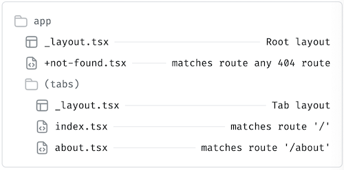

# React Native Notes

<a href="https://tecnate.dev" target="_blank" rel="author">Tecnate</a> | Last Updated: 22 Nov 2024

---

## Table Of Contents

- [React Native Notes](#react-native-notes)
  - [Table Of Contents](#table-of-contents)
  - [Getting Started](#getting-started)
    - [What is React Native?](#what-is-react-native)
    - [Setting up the development environment](#setting-up-the-development-environment)
    - [Expo vs React Native CLI](#expo-vs-react-native-cli)
  - [Core Concepts](#core-concepts)
    - [Components (Functional \& Class)](#components-functional--class)
    - [Props and State](#props-and-state)
    - [Lifecycle Methods (useEffect and beyond)](#lifecycle-methods-useeffect-and-beyond)
  - [UI Basics](#ui-basics)
    - [Views and Layouts](#views-and-layouts)
    - [Styling with StyleSheet](#styling-with-stylesheet)
    - [Flexbox in React Native](#flexbox-in-react-native)
  - [Navigation](#navigation)
    - [Expo Router \& File Based Routing](#expo-router--file-based-routing)
    - [Stack, Tab, and Drawer Navigators](#stack-tab-and-drawer-navigators)
  - [Working with APIs](#working-with-apis)
    - [Fetching Data (REST API with Fetch or Axios)](#fetching-data-rest-api-with-fetch-or-axios)
    - [Using AsyncStorage for local storage](#using-asyncstorage-for-local-storage)
    - [Managing State (Context API or Redux)](#managing-state-context-api-or-redux)
  - [Platform-Specific Features](#platform-specific-features)
    - [iOS vs Android Differences](#ios-vs-android-differences)
    - [Handling Permissions (e.g., Camera, Location)](#handling-permissions-eg-camera-location)
  - [Media and Assets](#media-and-assets)
    - [Images and Videos](#images-and-videos)
    - [Icons and Fonts](#icons-and-fonts)
    - [Linking assets in React Native](#linking-assets-in-react-native)
  - [Forms and Input](#forms-and-input)
    - [TextInput Basics](#textinput-basics)
    - [Handling Keyboard Avoidance](#handling-keyboard-avoidance)
    - [Form Libraries (Formik, React Hook Form)](#form-libraries-formik-react-hook-form)
  - [Advanced Features](#advanced-features)
    - [Animations (Reanimated or Animated API)](#animations-reanimated-or-animated-api)
    - [Gesture Handling (React Native Gesture Handler)](#gesture-handling-react-native-gesture-handler)
    - [Native Modules and Linking](#native-modules-and-linking)
  - [Performance Optimization](#performance-optimization)
    - [Avoiding Re-renders](#avoiding-re-renders)
    - [Using FlatList and SectionList Efficiently](#using-flatlist-and-sectionlist-efficiently)
    - [Memory Management and Debugging Tools](#memory-management-and-debugging-tools)
  - [Debugging and Testing](#debugging-and-testing)
    - [Common Errors and Fixes](#common-errors-and-fixes)
    - [Debugging with React Developer Tools](#debugging-with-react-developer-tools)
    - [Testing with Jest or Detox](#testing-with-jest-or-detox)
  - [Deployment](#deployment)
    - [Building for Android and iOS](#building-for-android-and-ios)
    - [Using Expo for OTA updates](#using-expo-for-ota-updates)
    - [Publishing to App Stores](#publishing-to-app-stores)
  - [Community and Resources](#community-and-resources)
    - [Official Documentation and Guides](#official-documentation-and-guides)
    - [Popular Libraries to Know](#popular-libraries-to-know)
    - [Staying Up-to-date with React Native](#staying-up-to-date-with-react-native)

---

---

## Getting Started

### What is React Native?

### Setting up the development environment

### Expo vs React Native CLI

## Core Concepts

### Components (Functional & Class)

### Props and State

### Lifecycle Methods (useEffect and beyond)

## UI Basics

### Views and Layouts

### Styling with StyleSheet

### Flexbox in React Native

## Navigation

### Expo Router & File Based Routing



-   `+` Routes: Pages/Screens the user can navigate to.
-   `_` Layouts: Non-navigable components that organize or group routes.

For Example:

```bash
app/
_layout.tsx # Shared layout for all pages in this folder.
+index.tsx # Route for the "home or index" screen.
+profile.tsx # Route for the "profile" screen.
+not-found.tsx # Special route for unmatched paths (404 page).
```

When the app is running:

-   Navigating to `/index` will render `+index.tsx` wrapped in `_layout.tsx`.
-   If the user navigates to a nonexistent path, `+not-found.tsx` will be shown.

### Stack, Tab, and Drawer Navigators

`<Stack>` is a component that helps you manage navigation between different screens in your app. It organizes your app's screens to function like cards in a deck.

1. Each `<Stack.Screen>` in your app is a card/page or group.
2. You can "push" a new screen onto the stack (add it to the end of the array, i.e. go to a new page).
3. You can "pop" a screen off the stack (remove it from the end of the array, i.e. go back to the previous page).

Tabs are controlled by the group `(tab)`. You can create any group using `()` enclosing your group's directory name. Any new `(group)` that you create will need its own `_layout.tsx` file inside

## Working with APIs

### Fetching Data (REST API with Fetch or Axios)

### Using AsyncStorage for local storage

### Managing State (Context API or Redux)

## Platform-Specific Features

### iOS vs Android Differences

### Handling Permissions (e.g., Camera, Location)

## Media and Assets

### Images and Videos

### Icons and Fonts

### Linking assets in React Native

## Forms and Input

### TextInput Basics

### Handling Keyboard Avoidance

### Form Libraries (Formik, React Hook Form)

## Advanced Features

### Animations (Reanimated or Animated API)

### Gesture Handling (React Native Gesture Handler)

### Native Modules and Linking

## Performance Optimization

### Avoiding Re-renders

### Using FlatList and SectionList Efficiently

### Memory Management and Debugging Tools

## Debugging and Testing

### Common Errors and Fixes

### Debugging with React Developer Tools

### Testing with Jest or Detox

## Deployment

### Building for Android and iOS

### Using Expo for OTA updates

### Publishing to App Stores

## Community and Resources

### Official Documentation and Guides

### Popular Libraries to Know

### Staying Up-to-date with React Native
