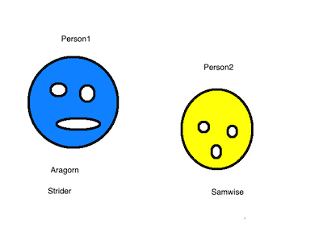

# JavaScript Notes

<a href="https://tecnate.dev" target="_blank" rel="author">Tecnate</a> | Last Updated: 2024.02.12

## Table of Contents

-   [JavaScript Notes](#javascript-notes)
    -   [Table of Contents](#table-of-contents)
    -   [Before You Begin Coding](#before-you-begin-coding)
        -   [Outline Structure](#outline-structure)
        -   [Remember: Pseudocode Is Your Friend](#remember-pseudocode-is-your-friend)
        -   [Remember: Work Small](#remember-work-small)
        -   [Start ASAP](#start-asap)
    -   [JavaScript Paradigm](#javascript-paradigm)
    -   [Data Types](#data-types)
        -   [Primitives](#primitives)
        -   [Objects](#objects)
    -   [Data Variables](#data-variables)
    -   [Data Type Comparison, Conversion, \& Coercion](#data-type-comparison-conversion--coercion)
        -   [Primitives Comparison](#primitives-comparison)
        -   [Object Comparison](#object-comparison)
    -   [State Management](#state-management)

<br>

## Before You Begin Coding

There are a few things that you will pick up as you learn how to write more and more complex code. Save yourself the time that would otherwise be spent learning by trial and error by internalizing these key ideas:

### Outline Structure

1. Explicitly identify what you are trying to do.
    1. “The purpose of my program/script/code is **\_\_**.”
2. List out the **main** steps that you anticipate.
    1. Flowcharts are great for visualizing information flow and logic control.
    2. Focus on the destination at this stage more than every step along the way.
        1. Don’t worry if you don’t know every step ahead of time.
        2. It’s normal (and often necessary) to change your strategy once you actually begin.

### Remember: Pseudocode Is Your Friend

1. It is a professional tool: use it to outline requirements for contracts or clients.
    1. Everyone involved will have a better understanding of the scope, complexity, and timeline if you take a moment to think through the steps of your development.
2. It should clearly outline tasks and include:
    1. Input
        1. read, get, input, find, etc.
    2. Processing
        1. add, transform, concatenate, sort, calculate, etc.
    3. Output
        1. post, output, print, return, log, etc.
3. Make it language independent
    1. Write statements that any programmer could utilize in their programming environment of choice.
    2. In general, try to begin new statements with a verb that makes it clear what your code needs to do.
        1. Nest loops under actionable statements when necessary.
    3. Name your variables within the statement.

**Pseudocode Example:** “Print the product of two numbers.”

-   Read two numbers, save as `num1` and `num2`.
-   Multiply `num1` and `num2`, save as `product`.
-   Print `product`.

### Remember: Work Small

1. Refer back to what you’re trying to accomplish and choose one specific item to tackle.
    1. Tunnel vision is usually better than thinking about everything all at once.
    2. Break up your work into tasks, not projects.
2. Assume that your future code will work so you can focus on the present code.
    1. Test your code often.
        1. Especially before you integrate it into any other code!
    2. Squash bugs as soon as you find them.
3. Assume that you’ll figure out how to integrate all the parts together.
    1. Get small parts of your code to work.
    2. Once you know the discrete parts are functional, you can focus on combining everything together into a cohesive script.

### Start ASAP

1. Don’t wait for perfect knowledge or understanding to begin a project.
    1. You’ll never know everything you need to know.
    2. Even if you did know everything at one point in time:
        1. Everything is subject to change: requirements, resources, funding, timelines, etc.
        2. Obsolescence is always around the corner.
2. Don’t wait for the perfect development environment or text editor customization.
    1. Create your environment as you go and discover what you need.

<br>

## JavaScript Paradigm

1. High-level Language
    - Designed for humans rather than machines.
    - High amounts of abstraction to resemble natural human language & math notation.
2. Just-in-time Compilation
    - JavaScript is interpreted (not compiled) during program execution rather than before.
3. Dynamic Typing
    - The same variable can hold different data types.
        ```jsx
        let x; // x is undefined
        x = 5; // x is now a number
        x = "John"; // x is now a string
        ```
4. Prototype-based Object Orientation
    - Objects inherit properties from parent object templates (prototypes).
5. First Class Functions
    - Functions can be:
        - Passed as arguments to other functions.
        - Returned by another function.
        - Assigned as a variable value.
6. Supports Multiple Programming Paradigms
    - Event-driven
        - The flow of programming is determined by events.
            - E.g. a mouse click, button click, key press, time interval, window resizing, etc.
        - **Most JavaScript is written to react to events.**
        - Event handlers can run at any time and in any order (i.e. they are asynchronous).
    - Functional
        - Declarative programming in which functions are trees of expressions that map values to other values.
    - Imperative
        - A sequence of imperative statements update the program's state.

<br>

## Data Types

There are two basic data types in JavaScript: Primitives & Objects.


_Source: “Head First JavaScript Programming - Chapter 7”_

-   Objects keep state and behavior, i.e. they have properties and methods.
-   Primitives simply represent data without state and behavior.
    -   The major exception is Strings. The JavaScript interpreter will temporarily create string objects as needed to support methods available to strings.
        ```jsx
        var password = "open$esame";
        var index = password.indexOf("$");
        console.log(index); // 4
        ```
    -   The minor exceptions are Numbers and Booleans which can sometimes act like objects, though not nearly as often as Strings.

### Primitives

Primitives are immutable (hardcoded and unchangeable) values that represent the lowest level of language.

```jsx
// Immutability
var greeting = "hello"; // "hello"
greeting.toUpperCase(); // still "hello"

// Assignment gives the primitive a new value, not a mutated one.
greeting = greeting.toUpperCase(); // "HELLO"
```

There are seven primitive types in JavaScript:

1. **String:** 'single', "double", `literal`.
2. **Number:** integers, floats, Infinity, -Infinity, NaN.

    1. **NaN (Not a Number)**: an illegal number value not equal to any value (including itself) and is treated falsy for booleans.

        ```jsx
        console.log(NaN == NaN); // false
        console.log(NaN != NaN); // true

        // WRONG
        let x = "banana";
        if (x == NaN) {
            console.log(x); // (Nothing happens)
        }

        // RIGHT
        let y = "orange";
        if (isNaN(y)) {
            console.log(y); // orange
        }
        ```

        - Used for numeric results that can’t be represented.
        - NaN is still a number type!

            ```jsx
            var a = 0 / 0;
            var b = "food" * 8;
            var c = Math.sqrt(-9); // JS can't natively represent complex numbers.

            console.log(a, b, c); // NaN NaN NaN
            console.log(typeof a, typeof b, typeof c); // number number number
            ```

    2. **Infinity or -Infinity:**  a property of the *global object* (i.e. a variable in global scope). Its value is greater than any other number.

        ```jsx
        console.log(typeof Infinity); // number
        console.log(Infinity == "infinity"); // false ("infinity" ==> NaN)
        console.log(Infinity - 16); // Infinity
        console.log(-Infinity < Infinity + 16); // true
        ```

3. **Bigint:** numbers bigger than 2^53 -1
4. **Symbol:** an always-unique, "hidden" identifier that no other code can accidentally access.
5. **Boolean:** true, false
6. **Undefined:** no value.

    - It’s assigned to variables, properties, or array items that don’t yet have a value (i.e. they haven’t been initialized) or functions that don’t return anything:

        1. Variables without a value assignment.

            ```jsx
            var x;
            console.log(x); // undefined (a value, not the string "undefined")
            ```

        2. Value of a property that doesn’t exist or has been deleted.

            ```jsx
            const person = {
                name: "John",
            };

            console.log(person.age); // undefined
            ```

        3. An item that doesn’t exist within a sparse array.

            ```jsx
            var sparseArray = [];
            sparseArray[0] = "peach";
            sparseArray[5] = "apple";
            console.log(sparseArray[3]); // undefined
            ```

        4. Functions without a `return` statement.

    - Can be an identifier for a property of a global object.
    - Treated falsey (or falsy) for booleans.
    - Undefined is a primitive type but can also be a value.
        - If undefined is a value, its type is undefined (because it isn’t a string or number or object or anything else).

7. **Null:** no object.
    - The intentional absence of any object value indicates that the variable points to no object.
        - Assigning null to a variable means “I’m going to assign an object to this variable at some point, just not yet.”
    - Treated falsy for booleans.

<table>
  <thead>
    <tr>
      <th>
        undefined
      </th>
      <th>
        null
      </th>
  </thead>
  
  <tr>
    <td>
      Variables that haven’t been initialized.
    </td>
    <td>
      The object can't be created/found
    </td>
  </tr>
  
  <tr>
    <td>
      Objects with a missing property.
    </td>
    <td>
      `document.getElementById`
      for an object that doesn’t exist in the DOM.
    </td>
  </tr>

  <tr>
    <td>
      Arrays with a missing value
    </td>
    <td>
     -
    </td>
  </tr>
</table>
    
### Objects
Objects are a collection of properties for state & behavior. They can be of any type, including other objects.

-   Objects are written as **{key: value}** pairs.
-   Any value that isn’t a primitive type is an object.

<aside>
✅ **Scripting Best Practice**

-   Declare objects with `const`.

```jsx
const myCar = {
	name: "Batmobile",
	make: "Custom"
	navigation: true,
	passengers: 2
};
```

</aside>

When you pass an object into a function call, you’re passing in the object’s _reference_, not the object itself.

-   Changing object properties inside a function **changes the original object’s properties!**

    ```jsx
    const snoopy = {
        weight: 40,
    };
    console.log(snoopy.weight); // 40

    // Function calls with objects will update the original object
    function loseWeight(dog, amount) {
        dog.weight = dog.weight - amount;
    }

    loseWeight(snoopy, 5);
    console.log(snoopy.weight); // 35 (Original object has been changed)
    ```

<br>

## Data Variables

-   Primitive variables represent the _value_ of the variable.
-   Object variables represent _a way to get to the object_.
    -   Their variables hold a _reference_ that points to the object, which is accessed by the interpreter.

Note: unlike object variables, primitive variable values are shadowed in functions.

<br>

## Data Type Comparison, Conversion, & Coercion

**Type Coercion:** the process of automatic conversion of values from one data type to another.

### Primitives Comparison

1. String `+` Number == String.

    1. Numbers will be converted to strings using coercion and then concatenated with the string.
    2. `+` is always interpreted as concatenation when one of the operands is a string.

        ```jsx
        console.log(typeof ("apple" + 7)); // string ("apple7")
        ```

2. String `* - / %` Number == Number.

    1. All non-number values are converted into the number data type.

        ```jsx
        console.log(typeof ("apple" * 7)); // number (NaN)
        console.log(typeof ("apple" - 7)); // number (NaN)
        console.log(typeof ("apple" / 7)); // number (NaN)
        console.log(typeof ("apple" % 7)); // number (NaN)
        ```

3. Boolean `+ * - / %` Number == Number:

    1. Boolean values are converted to a number type for comparison: 0 for false, 1 for true.

        ```jsx
        console.log(typeof (false + 2)); // number
        console.log(false + 3); // 3 (false == 0)
        console.log(20 / true == 5 * 4); // true (true == 1)
        ```

4. The Equality Operator `==` can be used to compare values irrespective of type. Likewise with comparison operators `<`, `>`, `<=`, or `>=`.

    1. String & String

        ```jsx
        console.log("a" == "A"); // false (different Unicode values)
        console.log("a" > "b"); // false (first < second)
        console.log("a" > "B"); // true (lowercase > UPPERCASE)
        ```

    2. String & Number

        ```jsx
        console.log("apple" == 5); // false ("apple" ==> apple ==> NaN ≠ 5)
        console.log("5" == 5); // true ("5" ==> 5 == 5)
        console.log(99 <= "100"); // true ("100" ==> 100)
        ```

    3. Boolean & String

        ```jsx
        console.log(true == "apple"); // false
        console.log(true == "true"); // false (true ==> 1; "true" ==> NaN)
        console.log(false == "0"); // true (false ==> 0; "0" ==> 0)
        console.log(false != "apple"); // true ("apple" ==> apple ==> NaN))
        ```

    4. Boolean & Number

        ```jsx
        console.log(true == 1); // true
        console.log(true == NaN); // false (NaN not equal to anything)
        console.log(NaN == NaN); // false (NaN not even equal to itself)
        console.log(false == NaN); // false
        console.log(true != NaN); // true
        console.log(19 < false); // false (false ==> 0)
        ```

    5. Boolean & Undefined/Null

        ```jsx
        console.log(null == undefined); // true (null & undefined are always equal)
        console.log(true == null); // false
        console.log(true != null); // true
        console.log(false == undefined); // false
        console.log(false == ""); // true (false ==> 0; "" ==> 0)
        console.log(44 >= ""); // true ("" ==> 0)
        ```

### Object Comparison

<br>
_OBJECTS: Person1, Person2_ <br>
_REFERENCES: Aragorn, Strider, Samwise_

```jsx
const person1 = {
    type: "Human",
};

const person2 = {
    type: "Hobbit",
};

let aragorn = person1;
let strider = person1;
let samwise = person2;

if (aragorn == strider) {
    console.log("Same person.");
} else {
    console.log("Different people.");
}

// Same person.
```

<br>

## State Management

The web is stateless, meaning that webpages are recreated at the time they are requested. Because HTTP is a stateless protocol, it can’t hold client information on the webpage.

**ViewState** is specific to a page in a session. It is a server-side class object that stores data on the client side in an encrypted (hashed) format and can’t be read by plain JavaScript. - ViewState variable can be accessed inside JavaScript code with the help of Server Side Code Blocks in ASP.Net with C# and VB.Net.

**SessionState** is specific to user-specific data that can be accessed across all web application pages.

<table>
  <thead>
    <tr>
      <th>
        ViewState
      </th>
      <th>
        SessionState
      </th>
  </thead>
  
  <tr>
    <td>
    Maintained at page level.
    </td>
    <td>
    Maintained at session level.
    </td>
  </tr>
  
  <tr>
    <td>
    Values retained in the event of a postback operation.
    </td>
    <td>
    Data is available to user until the browser is closed or there is session expiration.
    </td>
  </tr>

  <tr>
    <td>
    Information is stored on the client’s end only (e.g. browser).
    </td>
    <td>
    Information is stored on the server.
    </td>
  </tr>

   <tr>
    <td>
    Allows persistence of user-specific data at the page level.
    </td>
    <td>
    Allows persistence of user-specific data throughout the entire web app.
    </td>
  </tr>

   <tr>
    <td>
    Values are cleared when a new page is loaded.
    </td>
    <td>
    Can be cleared by developer, user, or timeout.
    </td>
  </tr>
</table>
